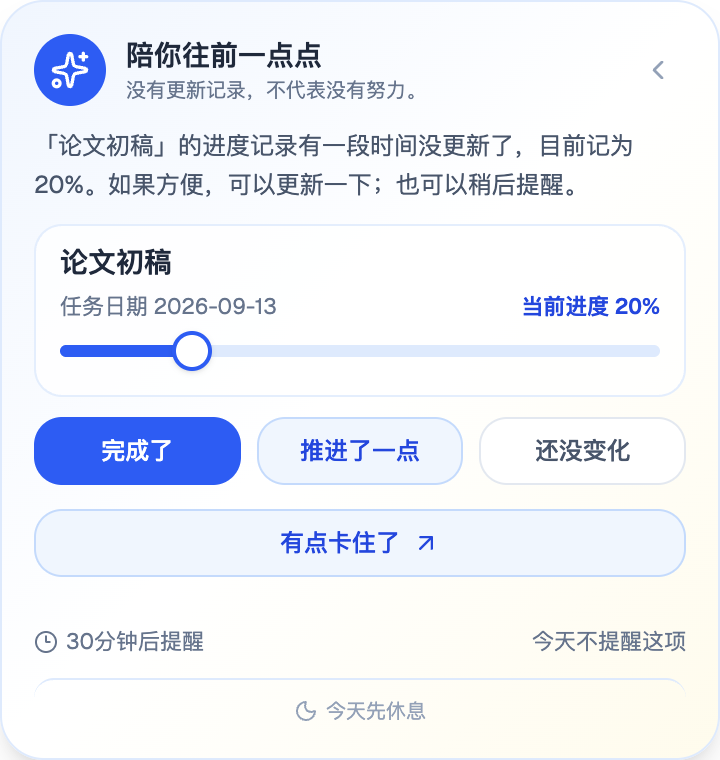
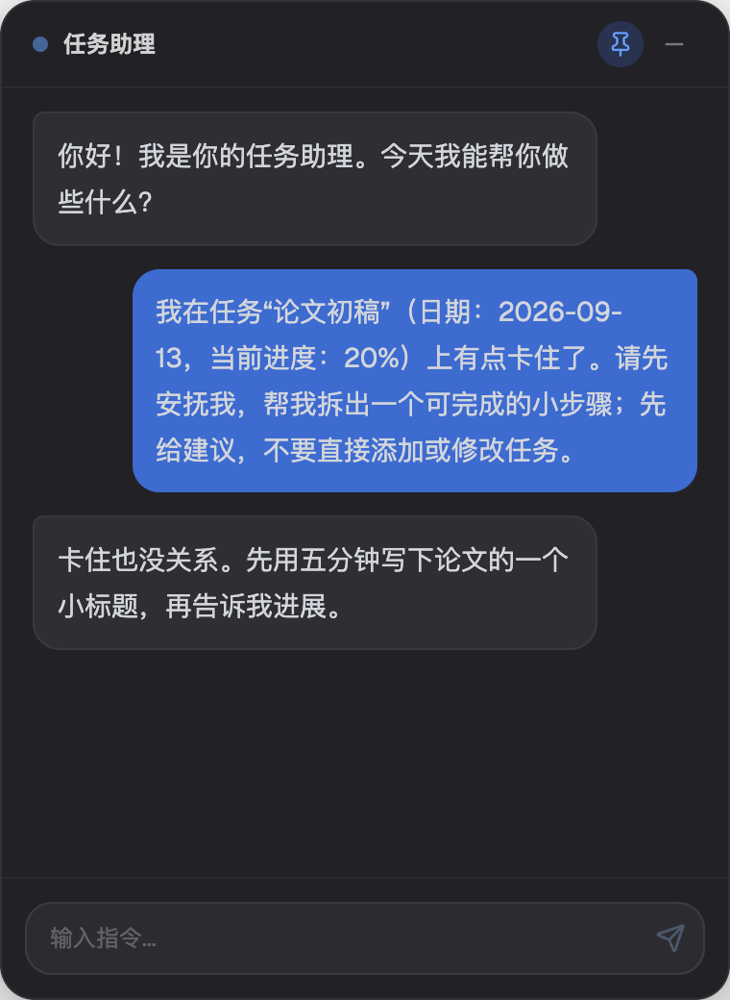

# TaskAgent

用对话管理任务，用进度记录持续性工作。TaskAgent 是一款本地保存数据的 AI 桌面任务助手，提供任务面板、桌面悬浮球、进度提醒、长期记忆和历史报告。

[下载最新版](https://github.com/liulinlin718-netizen/task-agent/releases/latest) · [更新日志](CHANGELOG.md) · [架构说明](docs/architecture.md) · [参与贡献](CONTRIBUTING.md)

## 下载与安装

在 [GitHub Releases](https://github.com/liulinlin718-netizen/task-agent/releases/latest) 的 **Assets** 中选择与你的设备匹配的安装包。安装版不需要 Node.js。

| 设备 | 选择的架构 | 安装方式 |
| --- | --- | --- |
| 搭载 Apple Silicon 的 Mac（M 系列芯片） | `TaskAgent-<版本>-mac-arm64.dmg` | 打开 DMG，将 TaskAgent 拖入“应用程序” |
| 搭载 Intel 处理器的 Mac | `TaskAgent-<版本>-mac-x64.dmg` | 打开 DMG，将 TaskAgent 拖入“应用程序” |
| Windows 64 位电脑（Intel / AMD） | `TaskAgent-<版本>-win-x64.exe` | 运行安装程序，按提示选择安装位置 |

Mac 可在“关于本机”中查看芯片或处理器。macOS 的 ZIP 包提供同架构应用的压缩版本；Windows ARM64 暂无专用安装包。

当前 macOS 包使用 ad-hoc 签名，未通过 Apple Developer ID 签名与公证；Windows 包未签名，系统可能提示开发者或应用不受信任。确认下载来自本仓库且你信任该版本后：

- macOS：先尝试打开应用，再进入“系统设置 → 隐私与安全性”，按系统提供的“仍要打开”流程确认。参见 [Apple 官方说明](https://support.apple.com/zh-cn/guide/mac-help/mh40616/mac)。
- Windows：如果是 SmartScreen 的未识别应用提示且提供相应选项，可选择“更多信息 → 仍要运行”。参见 [Microsoft 的发行说明](https://learn.microsoft.com/en-us/windows/apps/package-and-deploy/publish-first-app#step-6-handle-smartscreen-for-new-apps)。

如果系统或组织策略不提供继续选项，请停止安装并反馈具体提示；不要关闭 Gatekeeper、SmartScreen 或其他系统保护来安装。签名状态如有变化，以对应 Release 说明为准。

升级前建议在“设置”中导出加密备份。应用目前没有自动更新功能，请从 Releases 下载新版。

## 开始使用

首次启动的任务列表为空。可以直接在任务面板添加任务、选择日期、填写备注和优先级，用 0–100% 记录进度；这些操作不需要 AI 服务。

要使用对话、文档理解和报告，进入“设置”填写自己的模型配置：

1. **API Base URL**：支持 OpenAI Chat Completions 的兼容 API 根地址，通常以 `/v1` 结尾，不要附加 `/chat/completions`。
2. **模型名称**：选择支持工具调用（Tool Calling）的模型。客户端支持流式回复，也能读取兼容服务返回的非流式结果。
3. **API Key**：该服务的密钥；无需配置 `.env` 文件。服务费用由你使用的模型供应商收取。

设置中的供应商快捷按钮只填写地址，请自行确认模型名称及工具调用支持。“高级：Report Agent 独立配置”可单独设置报告模型、地址和密钥；留空字段分别沿用全局配置。

可以从这些对话开始：

| 你说 | 助手可以做什么 |
| --- | --- |
| “添加明天准备组会的任务” | 创建任务 |
| “把阅读论文的进度改成 60%” | 查询匹配任务并更新进度 |
| “把论文修改拆成几个小步骤，先给建议” | 展示建议，采纳后才加入任务 |
| “总结这周的工作” | 根据任务记录生成并保存报告 |
| “今天有点累，想聊聊” | 普通对话，无需修改任务 |

对话中会展示实际工具执行结果。修改或删除任务时，执行器会检查来源日期和名称匹配；无法确定具体任务时，先要求澄清。规则和模型都可能无法理解某些表达，建议提供完整任务名与日期，并在任务面板核对结果。

## 主要功能

- **任务与进度**：按日期管理任务，支持名称、进度、备注、优先级和删除操作。
- **共享对话**：主窗口与悬浮球使用同一套任务和会话数据；直接描述需求，支持流式输出、停止生成和查看工具记录。重新生成只允许查询与建议，已执行操作不会重复执行或被撤销。
- **桌面入口**：可拖动悬浮球、磁吸任务侧栏和系统托盘。关闭主窗口后可从托盘恢复。
- **长期记忆**：手动个人档案与对话中的稳定自述分别管理；可查看原句、编辑、删除或关闭自动学习。跨会话按相关性使用这些资料。
- **文档输入**：支持 TXT、DOCX 和带文本层的 PDF；本机提取文字，每个文件最多 10 MB、取前 8,000 个字符。不支持扫描件 OCR。
- **历史与报告**：按日期回顾任务，保存 Markdown 报告；默认凌晨 02:00 开始新的逻辑日，未完成任务保留进度结转。离线时也会先保存本地统计摘要。
- **加密备份**：导出 `.taskagent` 文件，使用密码恢复任务、对话、档案、记忆与设置。

### 桌宠进度提醒

在“设置”中同时开启“桌面悬浮球”和“主动进度提醒”。默认对逻辑今天的未完成任务，在 **2 小时没有更新进度记录**后轻轻提醒；可选 30 分钟、1 小时、2 小时或 4 小时。

提醒先出现在蓝色圆球旁的小气泡中；点击气泡或圆球可展开详情，也可以收回气泡。气泡中可直接选择稍后提醒。

<p></p>
<p></p>

详情提供这些操作：

| 操作 | 结果 |
| --- | --- |
| **完成了** | 将进度记为 100% |
| **推进了一点** | 在当前进度上加 10 个百分点，最多 100%；例如 20% → 30% |
| **还没变化** | 保持进度，只确认近况并重新计时 |
| **任务进度条** | 拖动任务进度条选择 0–100%，松手即保存并同步任务；键盘调节结束时保存，相同数值也会重新计时 |
| **有点卡住了** | 准备包含任务名称、日期和当前进度的普通求助草稿，可自由编辑，由你点击发送后再寻求 AI 帮助 |
| **稍后提醒** | 只暂缓这一项任务；连续暂缓依次为 30、60、120 分钟，之后保持 120 分钟 |
| **今天不提醒这项** | 今天暂停这一项任务的提醒 |
| **今天先休息** | 今天暂停所有任务的主动提醒 |

在悬浮球对话中直接说明要处理的任务与日期。求助草稿也是普通消息，助手按你最终发送的内容理解需求；名称或日期有歧义时会先追问。任务在处理期间被另一窗口删除、改名或改期时，相应写入会被拒绝，需要重新确认。

<p></p>

默认 **22:00–09:00 静默，每个逻辑日所有任务合计最多 3 次**；静默起止时间相同表示不设静默时段。气泡与详情不抢输入焦点，提醒创建 5 分钟后过期收起。单项暂缓不暂停其他任务，但所有提醒仍遵守全局间隔、静默和每日上限；到期的暂缓任务可豁免当次全局间隔。更新或确认进度后，该任务的连续暂缓次数重新计算。

暂缓、休息和冷却状态跨重启保存。在设置中“恢复主动提醒”可解除单项今日暂停、全局今日休息及旧版全局暂缓；不清除各任务的稍后提醒时间，也不重置当天次数或正常冷却。

没有更新记录，不代表没有努力。基础提醒和直接保存进度在本机完成，不调用模型。悬浮球聊天、拖动、锁屏或休眠时不新弹提醒；关闭悬浮球、关闭提醒开关或完全退出应用后停止提醒。

## 数据与隐私

**数据保存在本机，使用 AI 时相关内容仍会发送给你配置的模型服务。** 对话、报告、日报、滚动摘要，以及开启自动学习后符合条件的用户自述，都可能触发模型请求。被选中的任务、对话、档案、记忆和文档文字会作为上下文发送，供应商的数据处理规则适用。

- Electron 在系统应用数据目录保存两个文件：`taskagent-data.json`（任务、对话、报告和设置）与 `taskagent-memory.json`（档案和对话记忆）。
- **运行数据和 API Key 是明文保存的。** 密码加密用于导出的备份文件，不用于运行中的本地文件。
- 自动学习默认开启；关闭后停止新学习，已有记忆仍可用于相关回复。清除对话记忆不会删除个人档案或原始聊天。
- “清理缓存”清理对话、日报和报告，保留任务、档案、记忆与设置；“清理全部数据”也会清除任务、档案、记忆和提醒记录，保留设置。
- 项目没有独立业务后端或云同步，也不提供内置模型或离线大模型。你可以配置支持相应协议的本地模型服务。

备份包含 API 配置，请妥善保管文件和密码。导入会恢复备份中的状态，操作前请先备份当前数据。

## 从源码运行

需要 **Node.js 22.13 或以上版本**、npm 和 Git。

```bash
git clone https://github.com/liulinlin718-netizen/task-agent.git
cd task-agent
npm ci
npm run setup:electron
npm run dev:electron
```

`setup:electron` 调用 Electron 官方安装器；对应二进制已安装时可重复执行。此步骤兼容依赖安装脚本被跳过的 npm 环境。开发和构建需要保留开发依赖。

仅预览网页界面可运行 `npm run dev`，访问终端中的地址。浏览器预览使用 localStorage 保存数据；悬浮窗口、托盘、主动提醒及备份导入导出需要桌面版。

## 测试与构建

```bash
npm run lint       # TypeScript 检查
npm test           # 业务、协议与存储测试
npm run build      # 构建前端到 dist/
npm run verify     # 依次运行上述三项
npm run test:e2e   # Electron 端到端测试
```

端到端测试使用隔离数据目录和本地模拟模型服务，不需要真实 API Key；需要图形桌面环境，默认需要空闲的 3000 端口。`verify` 不包含端到端测试。测试打包应用的方法见 [贡献指南](CONTRIBUTING.md#测试)。模拟测试验证客户端行为，不代表线上模型的准确率或可用性。

```bash
npm run build:mac  # 在 macOS 构建 DMG / ZIP
npm run build:exe  # 构建 Windows 安装包
```

安装包输出到 `release/`。构建架构、签名与发行流程见 [贡献指南](CONTRIBUTING.md#构建安装包)。

## 参与贡献

欢迎提交 [问题反馈](https://github.com/liulinlin718-netizen/task-agent/issues)、[Pull Request](https://github.com/liulinlin718-netizen/task-agent/pulls) 或文档改进。提交前请阅读 [CONTRIBUTING.md](CONTRIBUTING.md)；技术设计见 [docs/architecture.md](docs/architecture.md)。

## 许可证

本项目采用 [MIT License](LICENSE)。第三方依赖按各自许可证分发。
