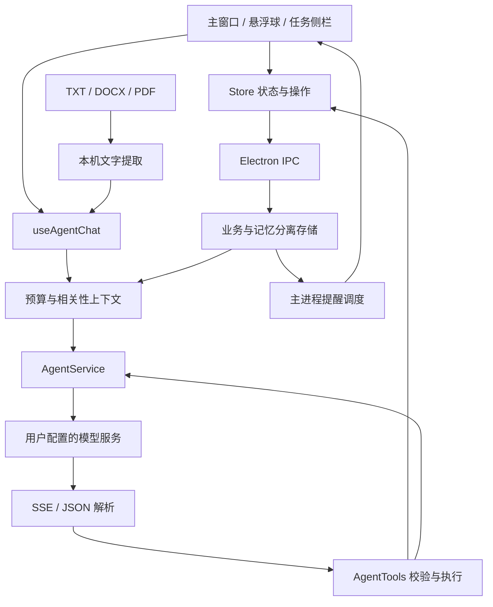

# 架构说明

TaskAgent 使用 Electron、React 19、TypeScript、Vite、Tailwind CSS 4 和 Motion。应用没有独立业务后端；模型请求通过 `fetch` 发送到用户配置的 OpenAI Chat Completions 兼容服务。安装和日常使用见 [README](../README.md)，开发步骤见 [贡献指南](../CONTRIBUTING.md)。

## 模块关系

| 入口 | 职责 |
| --- | --- |
| `src/Store.tsx` | 共享状态、任务/会话操作、持久化与错误反馈 |
| `src/hooks/useAgentChat.ts` | 主窗口与悬浮球共用的发送、取消、重生成流程 |
| `src/services/AgentService.ts` | 模型请求、工具调用循环、摘要与报告 |
| `src/services/AgentTools.ts` | 六个业务工具的定义、参数检查和执行 |
| `src/services/TaskGuard.ts` | 来源/目标日期与名称歧义的写入检查，兼容旧任务引用 |
| `src/services/StreamParser.ts` | SSE 帧、文字增量及工具参数分片 |
| `src/services/AgentContext.ts` | 初始上下文字符预算、资料检索和任务选择 |
| `src/services/IntentExamples.ts` | 成组 few-shot 示例库与选择规则 |
| `src/services/MemoryService.ts` | 稳定自述候选、独立工具审核与原文校验 |
| `src/services/DocumentParser.ts` | TXT、DOCX、PDF 文字提取 |
| `src/state/` | 状态迁移、逻辑日期、记忆修订、浏览器存储与提醒类型 |
| `src/components/` | 任务、对话、历史、档案、设置与桌面界面 |
| `src/components/ReminderNudge.tsx` / `ReminderCard.tsx` | 桌宠轻气泡、提醒详情与快捷反馈 |
| `components/ui/` | 界面基础组件 |
| `electron-main.cjs` / `electron-preload.cjs` | 窗口、托盘、受限 IPC 与桌面调度 |
| `electron/storage.cjs` | 数据校验、事务保存、窗口合并与备份加密 |
| `electron/proactive.cjs` | 提醒资格、冷却、静默、每日上限和动作校验 |
| `tests/` | 业务与桌面流程测试 |

## 工具调用闭环

主对话与悬浮球共用 `useAgentChat`，通过 API 的 `tools`、`tool_calls` 和 `role: "tool"` 消息完成操作：

1. 组装当前问题、相关任务、历史、记忆和提示示例，发送模型请求。
2. 解析文字增量和工具参数分片，等待调用完整后再解析参数。
3. 验证工具名、参数类型、日期、任务 ID 和数值范围，执行本地操作。
4. 显示执行记录，并用对应 `tool_call_id` 将结果交回模型。
5. 模型继续查询或操作，直至产生最终回复或达到调用上限。

| 工具 | 行为 |
| --- | --- |
| `list_tasks` | 按条件查询任务与真实 ID |
| `add_tasks` | 创建用户明确要求的任务 |
| `update_task` | 修改名称、进度、日期、备注或优先级 |
| `delete_task` | 删除指定任务 |
| `propose_tasks` | 展示待采纳建议，不直接创建任务 |
| `generate_report` | 按日期生成并保存报告 |

普通聊天可以直接回复。任务匹配不明确时提示模型先查询或追问；本地执行器只处理真实工具调用，并在修改/删除前检查日期和名称是否对应用户请求。服务返回非流式 Chat Completions JSON 时仍读取标准 `tool_calls`，没有旧版 `intent` JSON 执行回退。

业务循环最多 6 轮模型请求、24 次工具调用。普通请求超时为 30 秒，报告请求为 60 秒，业务对话总时限为 120 秒。取消停止后续步骤，已经保存的操作保留。重新生成只开放 `list_tasks` 和 `propose_tasks`，不会重新创建、修改、删除任务或保存报告。

提示约束用于指导模型；参数验证和工具权限在本地执行。模型语义理解仍可能有误，执行记录和任务面板是用户核对结果的入口。

### 任务识别与写入检查

悬浮球对话直接接收用户输入，不提供任务关联选择框、“正在聊”状态或历史消息绑定标签，新消息不附加显式任务引用。提醒中的求助动作只准备包含任务名称、日期与当前进度的普通可编辑草稿，用户发送后才调用模型，按最终发送的文本理解需求。

历史消息中的 `TaskContext` 仍兼容读取，保留 `taskId`、`taskName`、`taskDate` 三个字段，不迁移删除用户数据。旧引用仅用于解释对应历史消息，不绑定当前请求，也不构成新的操作授权；重新生成仍保持只读，不恢复任务绑定。

主窗口与悬浮球都由 `TaskGuard.ts` 进行来源日期与唯一名称匹配检查；模型提供一个存在的 ID 并不足以授权修改。日期规则区分原任务日期和“改到/移到”等表达后的目标日期；相对日期以实际时间按生物钟设置计算的逻辑今天为基准，新请求未提日期时使用当前选中日期。日期解析与名称匹配采用有限的日期格式和词项规则，不提供拼音转换或完整语义识别，无法可靠匹配时拒绝猜测并要求澄清。发生这类检查错误后，本轮后续非查询操作停止，模型只能继续查询并向用户确认。

### Few-shot 提示

`IntentExamples.ts` 提供 10 类虚构示例：聊天、新增、隐式完成、部分进度、查询后删除、歧义追问、建议、报告、否定和只读重生成。包含操作的示例成组展示用户消息、`assistant.tool_calls`、配对的工具结果与最终回复。

每次最多选择 3 组，保留聊天边界例，其他示例由当前输入的词项规则选择。只读模式与否定表达限制可选示例。完整示例以独立 system 消息中的 JSON 块提供，最多 2,400 字符，计入初始上下文预算；不截断半组，不执行，也不写入真实会话或记忆。

这是 in-context few-shot 提示，不是训练或微调分类器。选择规则仅负责取示例，实际业务执行依据模型返回的真实工具调用。

## 上下文与长期记忆

### 动态短期上下文

`AgentContext.ts` 按剩余额度分配初始消息的内容预算：

| 内容 | 字符上限 |
| --- | --- |
| 初始消息 `content` 合计 | 16,000 |
| 当前问题 | 9,000，优先保留 |
| 完整 few-shot 示例块 | 2,400，最多 3 组 |
| 最近历史 | 4,500 |
| 较早对话摘要 | 1,500 |
| 相关手动档案与长期事实 | 1,800 |
| 相关任务 | 2,000，最多 12 项 |

这些是各部分的上限，不能相加视为固定请求长度。基础提示也占初始预算；工具定义和后续工具往返不计入这项初始预算。字符数不等于 Token 数。

资料检索采用英文词项、中文单字/双字片段的相关性评分和少量场景规则，不依赖 embedding 或向量数据库。检索最多 5 条相关事实；相关手动档案优先分配预算。提示中的冲突处理顺序是：本次用户明确表述、手动档案、旧的自动学习事实。

会话通过 `summary` 和 `summarizedUpTo` 标记已摘要前缀，摘要保留最近六条历史消息（约三轮）不压缩。摘要失败不删除原始记录。原文保存在本机，但较早内容可能因本次预算而未进入请求，包括尚未摘要的旧消息。

### 长期事实学习

长期资料由手动档案与 `LongTermMemory` 组成。事实记录包含 `id`、语义 `key`、类别、内容、原句证据、来源会话/消息以及创建和更新时间。类别为背景、偏好、目标和限制。

正常回复完成后，学习流程独立运行：

1. 从当次真实用户消息中按保守规则选取稳定自述，排除附件、引用、假设、临时任务、撤回请求和疑似凭证。
2. 使用全局模型配置，强制调用独立的 `capture_memories` 工具；最长 8 秒，每次最多 5 条。它不属于六个业务工具。
3. 检查类别与逐字证据，初始 `content` 使用通过校验的用户原句，不存模型补写的事实；单条最多 500 字符。
4. 按规范化 `key` 更新同一属性，保留条目 ID。最多保存 100 条，满额时只更新已有属性，不静默淘汰旧记录。
5. 保存后回读核对实际结果，再显示成功状态。

自动学习默认开启，关闭只阻止新学习，已有事实仍参与相关检索。重新生成不学习；失败或取消不影响已经显示的正常回复。

个人档案页提供学习开关、事实编辑、来源查看和删除。手动修订会更新 `epoch`；保存前还会核对来源消息和目标回复是否仍存在，阻止迟到请求恢复已删除记忆或覆盖新修订。手动编辑内容可以不同于原句，原始证据继续保留。候选规则与词项检索覆盖有限，来源可追溯也不等于事实经过外部验证。

## 文档、报告与逻辑日

TXT 直接读取，DOCX 通过 mammoth 提取，PDF 通过 pdfjs-dist 提取文本层。文件最多 10 MB，提取片段最多 8,000 字符；PDF worker 随构建分发，解析后释放资源。没有 OCR，扫描 PDF 不能直接识别。文字在本机提取，发送后作为模型输入和会话上下文保存。未填写额外指令时，默认请求待用户采纳的任务建议。

报告从日期范围内的真实任务状态和备注生成 Markdown，保存后可在历史页面查看。报告的模型、地址与密钥分别覆盖全局配置；留空项分别继承。日报、滚动摘要和记忆学习使用全局配置。

逻辑日默认从当地时间 02:00 开始。日期变化时先保存未完成任务结转和本地统计摘要，再尝试 AI 日报；离线、无密钥或模型失败不阻塞结转。应用运行时约每分钟检查，退出期间不由云端代为执行，重新启动后检查。

## 桌面提醒

任务的 `lastProgressAt` 记录进度反馈时间。新建任务或进度发生变化时，由主进程保存入口统一写入；普通聊天、改名和改备注不重置计时。旧任务缺少时间时，从首次保存开始计时。提醒中的同值保存与“还没变化”也会确认近况并刷新时间，保持原进度。

主进程每 30 秒及相关数据成功保存后评估提醒。候选为逻辑今天的未完成任务，以实际日期而非界面选中的历史日期判断。默认未更新间隔 120 分钟，可选 30、60、120、240 分钟；默认 22:00–09:00 静默，每个逻辑日最多 3 次。

策略模块只转换状态，主进程负责读取最新数据、持久化、广播和展示。提醒首先以 328×112 的气泡窗口呈现，保留 48×48 的蓝色 Sparkles 圆球；点击后展开为 360×380 的详情窗口，可收回气泡。窗口采用 `showInactive`，不主动抢走输入焦点。展开与收回仅改变展示，不产生一次新的提醒计数。

提醒携带任务 ID、名称、日期、进度与更新时间；执行前重新校验，任务已变化、被删除或提醒过期时拒绝旧动作。动作由主进程根据最新的有效提醒计算并保存：

| 动作 | 行为 |
| --- | --- |
| `update` | 接受 0–100 的有限数值；拖动进度条松手或键盘调节结束时，直接保存进度与确认时间 |
| `complete` | 设为 100% |
| `advance` | `min(100, 当前进度 + 10)`，由“推进了一点”按钮触发 |
| `unchanged` | 保持原进度，只刷新确认时间 |
| `help` | 将真实任务名称、日期与当前进度写入普通可编辑求助草稿，同时将该任务暂缓 30 分钟；不建立任务绑定，不增加连续暂缓次数，也不调用模型或修改进度 |
| `snooze` | 仅对该任务递增暂缓时间：30 → 60 → 120 分钟，之后封顶 120 分钟 |
| `dismiss-task` | 暂停该任务直到下一逻辑日 |
| `today` | 全局暂停直到下一逻辑日 |

`proactive.taskStates` 按任务 ID 保存暂缓截止时间、连续暂缓次数、单项今日暂停标记和进度时间版本。任务进度被更新或确认后，暂缓及连续次数重置；完成或删除任务时移除相应记录。暂缓不冻结其他任务，但全局间隔、静默和每日合计 3 次限制继续生效；只有到期的暂缓任务能豁免当次全局间隔。兼容保留旧版全局暂缓状态。

设置中的恢复操作解除单项今日暂停、全局今日休息和旧版全局暂缓，保留各任务的暂缓时间与连续次数，不重置每日配额和全局冷却。未操作的提醒在创建 5 分钟后撤回，展开详情不会延长有效期。提醒计数、上次触达及各级暂停状态持久化，重启不重复展示上一个进程的提醒。悬浮球聊天、拖动、锁屏或休眠期间不新发提醒；重载和中断拖动时重置窗口状态。应用完全退出后停止调度。

基础提醒文本由本机生成，只描述“进度记录未更新”，不推断用户是否努力，也不通过模型轮询判断状态。

## 持久化与隐私边界

Electron 在应用数据目录分别保存：

- `taskagent-data.json`：任务、会话、报告、设置与提醒运行状态。
- `taskagent-memory.json`：个人档案与对话长期记忆。

存储先校验结构，通过事务日志协调两个文件的原子替换，保存完整的上一份有效 `.bak` 快照，并恢复中断事务或有效快照。当前完整状态的保护上限为 64 MB；仍受磁盘空间和全量序列化成本限制。浏览器预览使用 `taskagent-state` 与 `taskagent-memory` 两个 localStorage 项，并支持中断写入恢复。

多个桌面窗口提交读取时的状态与本次变更，主进程与最新状态做三方合并。删除优先，迟到更新不能复活已经删除的任务或会话；独立字段变更可合并，同一字段冲突由后提交的编辑覆盖。调度状态由主进程维护，允许界面执行受限的恢复提醒与清空操作。成功保存后的状态再广播给各窗口。

Agent 提交任务变更时，主进程还会在同步保存前检查原任务的名称、日期，以及历史消息可能携带的任务引用。另一窗口已删除、改名或改期时，整次提交会被拒绝，界面提示重新确认，成功操作记录也不会写入。没有任务变更的流式回复和建议不受这项检查影响。

运行数据和 API Key 为明文。导出 `.taskagent` 备份时合并业务数据与记忆，以 AES-256-GCM 加密，使用随机 salt、IV 和 PBKDF2-SHA256 派生密钥。新备份迭代 210,000 次，兼容旧版 100,000 次。导入先认证密码并校验状态，再恢复数据。

本地保存描述的是持久化位置。对话、报告、日报、摘要和符合条件的记忆学习会调用用户配置的模型服务，相关任务、档案、事实和提取的文档片段可能被发送。项目没有独立云同步后端，模型供应商的数据处理规则仍适用。

## 验证边界

`npm run verify` 运行类型检查、业务测试与前端构建；`npm run test:e2e` 在图形桌面中使用隔离数据目录和本地模拟模型服务测试 Electron。后者也支持指定打包应用执行文件，详见 [贡献指南](../CONTRIBUTING.md#测试)。

测试覆盖 SSE 分片、工具参数与往返、循环/超时/取消、只读重生成、上下文预算、记忆来源与修订、逻辑日、存储合并与恢复、加密备份、提醒策略和桌面交互。模拟服务验证指定响应下的客户端行为；线上模型准确率、延迟和用量需要单独测量。
